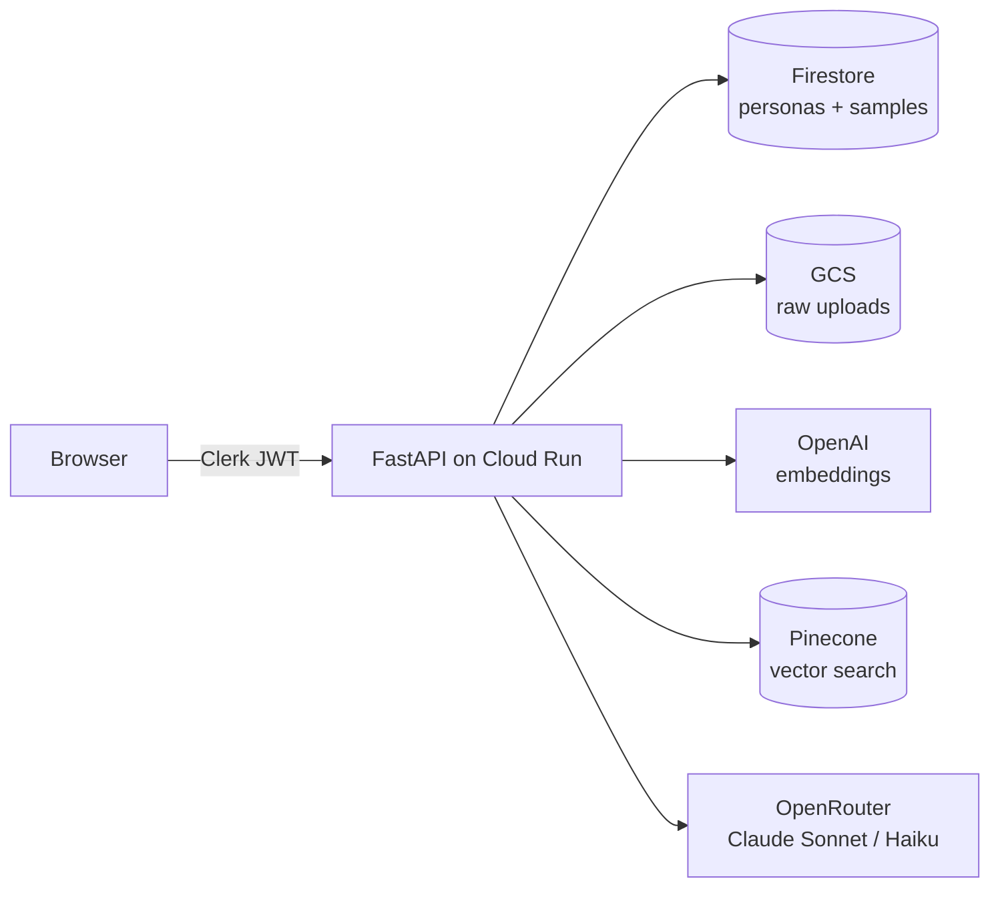

# Write2Style

An AI writing assistant that learns your voice from samples you upload, then drafts new content in that voice.

Upload 2–5 pieces of your own writing under a "Style Persona". The system extracts a Style DNA (tone, sentence structure, vocabulary, punctuation, idioms) from those samples and indexes the text in a vector database. When you ask it to draft something new, it retrieves the most stylistically relevant excerpts of your past writing and conditions the draft on those plus the Style DNA. The output reads like you, not like an LLM.

You can keep multiple personas — say, "Professional", "Whimsical", "Direct" — and switch between them per draft.

---

## Architecture



**Two pipelines run through the system:**

*Ingest* (per uploaded sample)

```
upload → extract text → chunk → embed → Pinecone upsert
                                      ↘ refine Style DNA → Firestore
```

*Generate* (per draft request)

```
prompt → embed → Pinecone top-k → inject DNA + few-shot → stream draft
```

Two models, by design: **Claude 3.5 Sonnet** for Style DNA extraction (heavier reasoning, infrequent), **Claude 3.5 Haiku** for drafting (cheaper, lower latency, runs on every request).

---

## Repository layout

```
backend/    FastAPI service — auth, ingestion, generation
  app/      route handlers, LLM/embedding/storage clients
  eval/     evaluation harness + LLM-as-judge
  tests/    unit + smoke tests (pytest)
frontend/   React + TypeScript + Vite (minimalist editor UI)
terraform/  GCP infrastructure (Cloud Run, GCS, Firestore, IAM, Secrets)
.github/    CI/CD workflows for backend + frontend + infra
prd.md      product requirements
setup.md    one-time manual setup steps
```

---

## Quick start

### Run locally

Backend:

```bash
cd backend
python -m venv .venv && source .venv/bin/activate
pip install -r requirements.txt
cp .env.example .env             # fill in real values
gcloud auth application-default login
uvicorn app.main:app --reload --port 8080
```

Frontend:

```bash
cd frontend
npm install
cp .env.example .env             # set VITE_CLERK_PUBLISHABLE_KEY + VITE_API_URL=http://localhost:8080
npm run dev                      # serves on http://localhost:5173
```

### Deploy to GCP

Full setup (one-time GCP/Clerk/Pinecone/OpenAI/OpenRouter onboarding + Terraform bootstrap) is documented in [`setup.md`](./setup.md). After that, every push to `main` under `backend/` or `frontend/` auto-deploys via GitHub Actions.

---

## Tech stack

| Layer | Choice | Why |
|---|---|---|
| Frontend | React + TypeScript + Vite | Fast dev loop; static-asset deploy fits Cloud Run nicely |
| Backend | FastAPI + Python 3.12 | First-class async, pydantic validation, excellent OpenAPI |
| Auth | Clerk | JWT verification only on the backend; no session state to manage |
| LLM | OpenRouter (Claude Sonnet / Haiku) | One API for two models, cheap fallbacks, no per-provider auth |
| Embeddings | OpenAI `text-embedding-3-small` (1536-dim) | Strong quality at low cost; matches Pinecone's serverless tier |
| Vector DB | Pinecone Serverless | Per-persona namespaces, scales to zero, free tier covers MVP |
| Object storage | GCS | Raw uploads (PDF/MD/TXT) before extraction |
| Database | Firestore | Persona + sample metadata; no schema management |
| Compute | Cloud Run | Serverless containers, scales to zero, AMD64 |
| IaC | Terraform | One source of truth for GCP resources, secrets, IAM |
| CI/CD | GitHub Actions + Workload Identity Federation | No long-lived service-account keys in CI |

---

## Engineering practices

- **Structured JSON logging** with per-request IDs, propagated through context vars. Every LLM/Pinecone/GCS call is timed and logged with model, counts, and durations. Cloud Logging picks up the JSON natively.
- **Stable error envelope**: every failure response is `{"error": ..., "request_id": ...}` with the request ID echoed in the `x-request-id` header.
- **Exception handlers** for HTTP, validation, and unhandled errors. No raw stack traces leak to clients.
- **Test suite**: pure-function tests for extraction/chunking/models, smoke tests for the API surface, plus tests for the eval harness components. Run with `pytest -q` from `backend/`.
- **Pre-commit hooks** (ruff, formatter) run on every commit.

---

## Evaluation

How do we know the model is actually mimicking style and not just generating generic prose? An offline harness in [`backend/eval/`](./backend/eval/README.md) compares three conditions per held-out prompt — `baseline` (no DNA, no RAG), `dna_only`, `dna_rag` — and grades each output against the actual author's reference passage using an LLM-as-judge on four dimensions (tone, vocabulary, structure, overall).

```bash
cd backend
python -m eval.run --report ../eval-report.md
```

A working pipeline shows `dna_only > baseline` and `dna_rag ≥ dna_only`. Methodology, data format, and interpretation guidance are in `backend/eval/README.md`.

---

## Documentation

- [`prd.md`](./prd.md) — product requirements and design rationale
- [`setup.md`](./setup.md) — one-time manual setup (GCP, Clerk, Pinecone, Terraform bootstrap)
- [`DEMO.md`](./DEMO.md) — 90-second guided walkthrough of the running app
- [`backend/eval/README.md`](./backend/eval/README.md) — evaluation methodology
